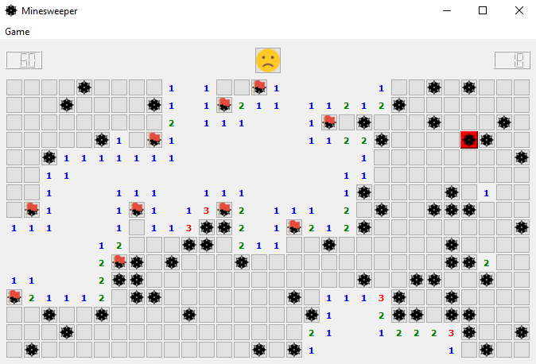
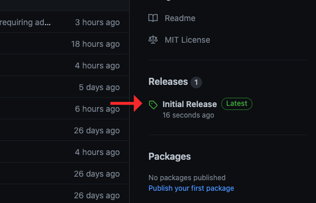
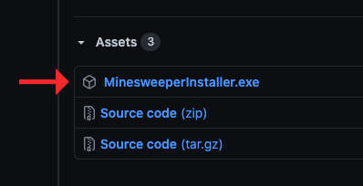

# Minesweeper
My implementation of Minesweeper using C++ and Qt for Windows.



&nbsp;

# Installing Pre-built Binaries
1. Click on the latest release installer from the Releases menu on the right.



2. Select the `MinesweeperInstaller.exe` installer to download.



3. Double-click on the downloaded `MinesweeperInstaller.exe` and follow the installer wizard. Note that if an installation directory requiring administrator privileges is selected, such as `Program Files (x86)`, then run `MinesweeperInstaller.exe` as administrator.

&nbsp;

# Compiling from Source
To compile Minesweeper from the source code, follow the instructions below.
1. Clone this repository into a directory of your choice and change directory into it.
```
> git clone git@github.com:jianwei-sun/minesweeper.git
> cd minesweeper
```
2. Modify and execute the `set_env_vars.bat` script so that the environment variables point to the relevant locations on your computer. 
```
SET WINDOWS_SDK_INCLUDE_DIR=C:\Program Files (x86)\Windows Kits\10\Include\10.0.18362.0\um
SET WINDOWS_SDK_LINK_DIR=C:\Program Files (x86)\Windows Kits\10\Lib\10.0.18362.0\um\x86
SET Qt5_DIR=z:\lib\qt
SET QT_BINARYCREATOR_DIR=C:\Qt\QtIFW-4.1.1\bin
```
```
> set_env_vars.bat
```
3. Create a `build` directory and change directory into it.
```
> mkdir build
> cd build
```
4. Generate the NMake Makefiles using CMake.
```
> cmake -G "NMake Makefiles" ..
```
5. Compile using NMake.
```
> nmake
```
6. The built `MinesweeperInstaller.exe` is located in the automatically created `release` directory.

&nbsp;

# Contributing
If you find any bugs or have any suggestions for improvement, please feel free to submit a pull request or contact me directly.